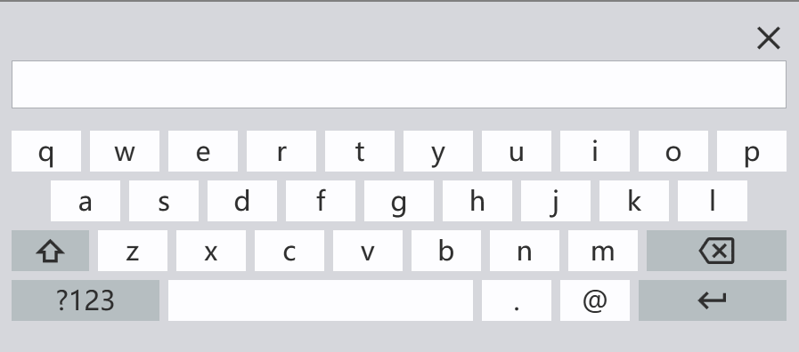
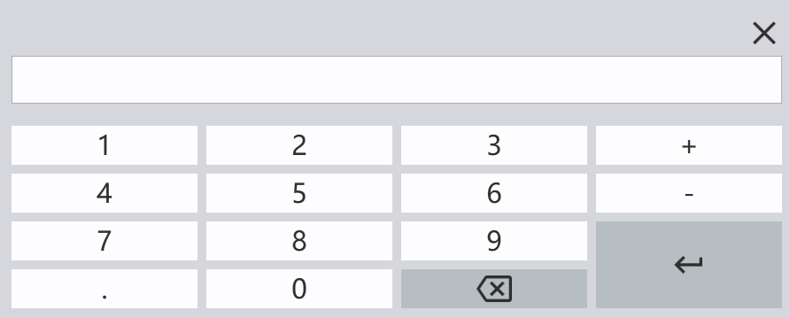
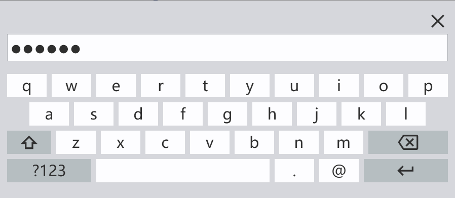
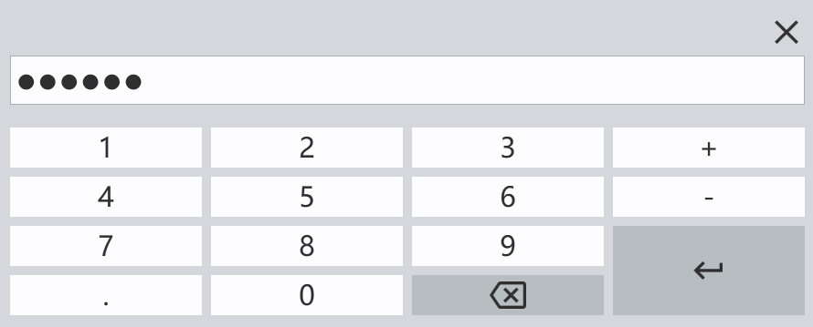

# wpf_customkeyboard

本项目是在[[VirtualKeyboard.Wpf](https://github.com/PatWegierski/VirtualKeyboard.Wpf)]项目的基础上进行更改，原项目基于 MIT 协议授权。

## 更新内容

1. 修改了原项目中键盘的样式，修复了一些问题；

2. 增加关闭按钮，可以取消修改；

3. 增加了单独数字键盘；

4. 增加了密码掩码模式；

   

## 使用方式

### 调用键盘

调用的方式与原项目相同。

1. 后台直接调用

   ~~~c#
   var value = await CustomKeyboard.OpenAsync();	
   ~~~

2. 监听控件的**PreviewMouseLeftButtonDownEvent**方法，自动弹出键盘

   ~~~c#
     CustomKeyboard.Listen<TextBox>(e => e.Text);
     
     CustomKeyboard.Listen<PasswordBox>(e => e.Password);
   ~~~

### 键盘样式与密码掩码显示

1. 默认正常布局的键盘

   

2. 设置`KeyboardType`属性为`Numeric`后，会显示数字键盘

   ~~~xaml
   <TextBox Height="40" controls:KeyboardTypeProperty.KeyboardType="Numeric" />
   ~~~

   

3. 设置`IsPassword`属性为`true`后，弹出正常布局键盘，显示的字符串会以密码掩码的形式呈现

   ~~~xaml
     <PasswordBox controls:PasswordDisplayProperty.IsPassword="True" />
   ~~~

   

   

4. 设置`IsPassword`属性为`true`、`KeyboardType`为`Numeric`后，弹出数字布局键盘，显示的字符串会以密码掩码的形式呈现

   ~~~xaml
    <PasswordBox
        controls:KeyboardTypeProperty.KeyboardType="Numeric"
        controls:PasswordDisplayProperty.IsPassword="True" />
   ~~~

   

## 注意

在`Listen`方法中针对TextBox和PasswordBox的光标位置做了单独的处理，保证在赋值后，光标能够显示在字符串最后的位置，如果使用别的类型控件或自定义控件时，可能需要自己处理：

~~~c#

    /// 

    ///     更新指定UI元素的光标位置
    /// 

    /// <typeparam name="T"></typeparam>
    /// <param name="s"></param>
    /// <param name="value"></param>
    private static void UpdateCaretIndex<T>(object s, string value) where T : UIElement
    {
        if (s is TextBox textBox)
            textBox.CaretIndex = value.Length;
        else if (s is PasswordBox passwordBox) SetPasswordBoxCaretToEnd(passwordBox);
    }

    /// 

    ///     设置 PasswordBox 的光标位置到末尾
    /// 

    /// <param name="passwordBox"></param>
    private static void SetPasswordBoxCaretToEnd(PasswordBox passwordBox)
    {
        if (passwordBox == null) return;

        passwordBox.Focus();

        // 反射调用 PasswordBox 的 Select 方法（非公开）
        var method = typeof(PasswordBox).GetMethod("Select", BindingFlags.Instance | BindingFlags.NonPublic);
        if (method != null)
        {
            var length = passwordBox.Password.Length;
            method.Invoke(passwordBox, new object[] { length, 0 }); // 光标移到末尾
        }
    }
~~~

